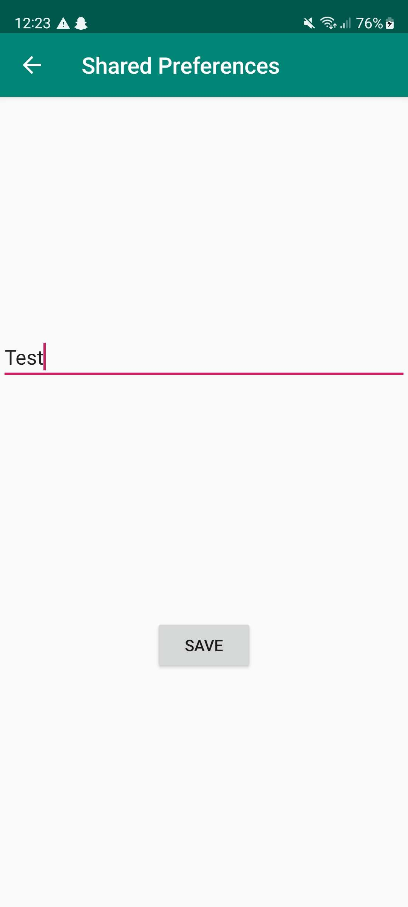
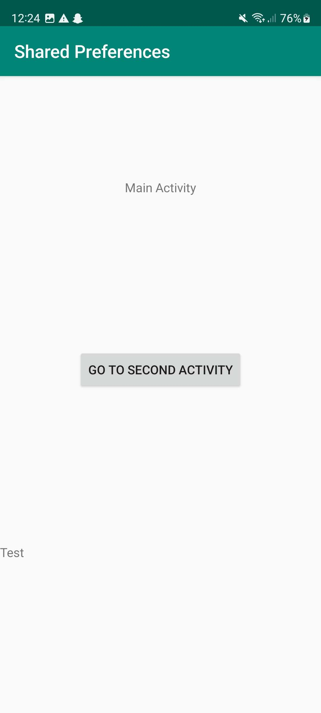

# Rapport

Jag har gjort en applikation där man kan klicka på en knapp i Main Activity för att komma till
Second Activity där man kan skriva text via en EditText. Man kan sedan spara den datan via en
spara-knapp. Texten längst ner på Main Activity uppdateras då till det nya man har skrivit in.

## Följande grundsyn gäller dugga-svar:

Koden nedan visar upp den nya texten som skrivits in och sparats i Second Activity när man
går tillbaka till Main Activity.
```
@Override
    protected void onResume() {
        super.onResume();

        TextView prefTextRef=new TextView(this);
        prefTextRef=(TextView)findViewById(R.id.prefText);
        prefTextRef.setText(myPreferenceRef.getString("MyAppPreferenceString", "No preference found."));
    }
```

Koden nedan är XML för EditText-rutan i Second Activity som man skriver in den nya texten i.
```
<EditText
      android:layout_width="match_parent"
      android:layout_height="wrap_content"
      app:layout_constraintTop_toTopOf="parent"
      app:layout_constraintBottom_toTopOf="@id/prefButton"
      app:layout_constraintStart_toStartOf="parent"
      app:layout_constraintEnd_toEndOf="parent"
      android:id="@+id/settingseditview"/>
```

Koden nedan är XML för spara-knappen som sparar det som står i EditText-rutan.
```
<Button
      android:text="@string/save"
      android:layout_width="wrap_content"
      android:layout_height="wrap_content"
      app:layout_constraintEnd_toEndOf="parent"
      app:layout_constraintStart_toStartOf="parent"
      app:layout_constraintBottom_toBottomOf="parent"
      app:layout_constraintTop_toBottomOf="@id/settingseditview"
      android:id="@+id/prefButton"
      android:onClick="savePref"/>
```

Koden nedan visar upp den nya texten som sparats från Second Activity.
```
<TextView
        android:layout_width="match_parent"
        android:layout_height="wrap_content"
        app:layout_constraintEnd_toEndOf="parent"
        app:layout_constraintStart_toStartOf="parent"
        app:layout_constraintBottom_toBottomOf="parent"
        app:layout_constraintTop_toBottomOf="@id/goToSecondActivity"
        android:id="@+id/prefText"/>
```

I bilden nedan skrivs "Test" in i EditText-rutan som sedan sparas via "save"-knappen.


I bilden nedan visas "Test" upp som skrevs in i Second Activity.
